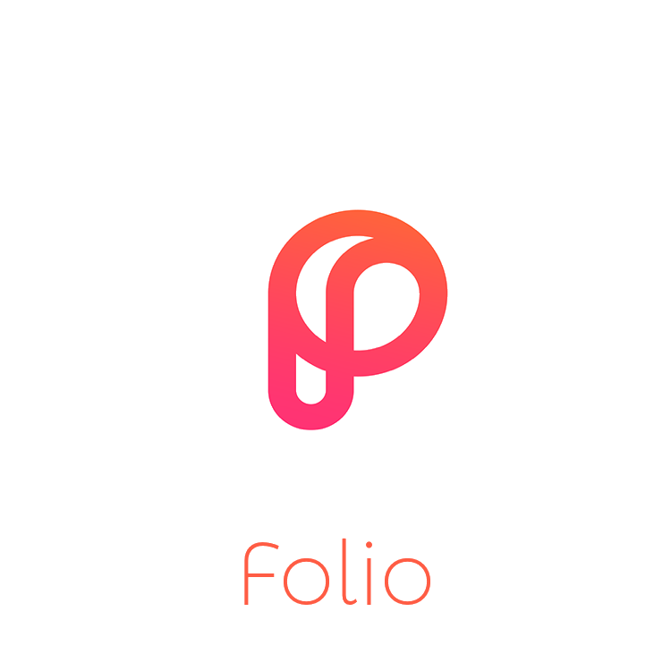
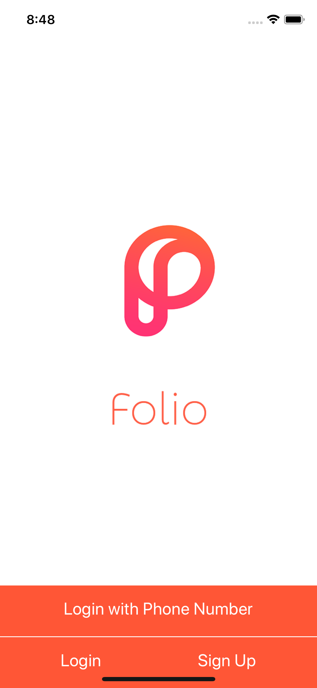
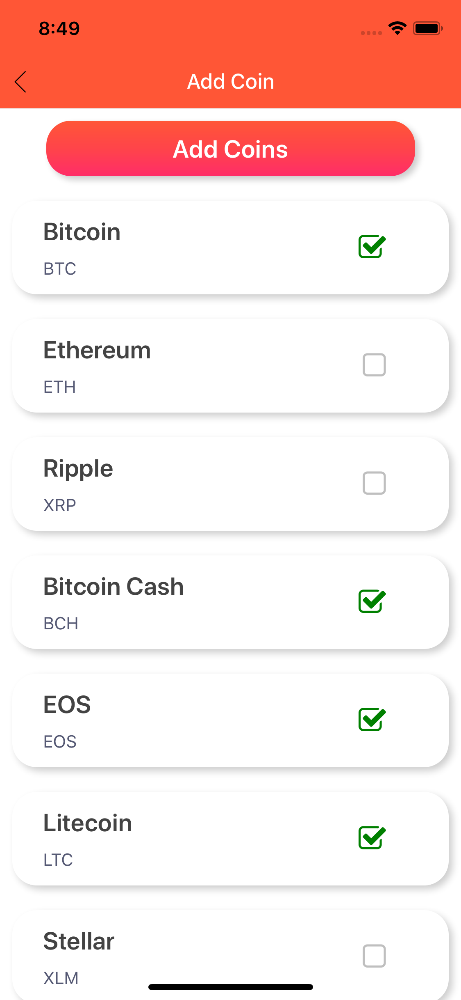
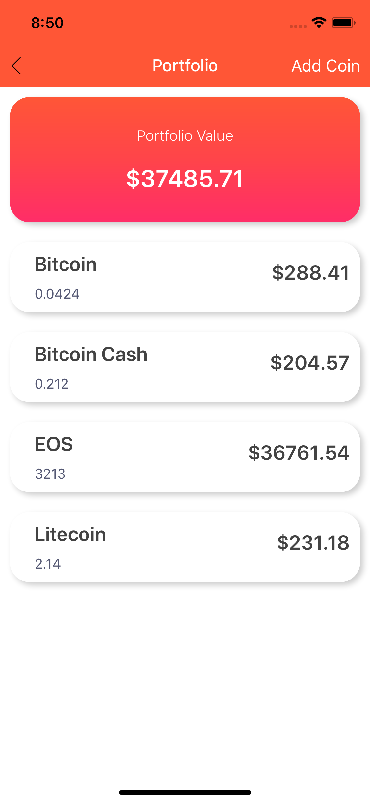

# Folio
<h3 align="center">
  Folio
</h3>

  Track your cryptocurrency portfolio value cross exchanges

  

### [Demo - Try it on Expo](https://expo.io/@anlai2/Folio)

## Features

- Users can track their cryptocurrency assets if they are being held cross exchange platforms or in a hardware wallet.
- They can also view current news events in cryptocurrency either through recent tweets or with the Crypto Coin News API
- Folio also allows users to track a portfolio that they might not exactly own. For example, if someone wanted to know how much USD they would hold if they invested x amount today.

- [x] API’s used
  * [CoinMarketCap.com API](https://coinmarketcap.com/api/documentation/v1/) for latest coin prices
  * [Twilio API](https://www.twilio.com/docs/api) for OTP authentication 
  * [Crypto Coins News API](https://newsapi.org/s/crypto-coins-news-api) for latest cryptocurrency news

### Screenshots

  
  
  

  
  
  

  
  
  

## TODO

Many issues that will occur will be opened on this github page, below are milestones/enhancements

- [ ] Start building prototype
  - [X] Fix Android UI design bugs
  - [X] Deploy to Play Store
  - [ ] Fix Apple UI design bugs
  - [ ] Deploy to Apple Store
  - [ ] Deploy to stores (Due 8/27/18)
  
- [ ] Enhancements and Issues
  - [ ] Switch from RNRF to React-Navigation
  - [ ] Use createBottomTabNavigator to route through news, portfolio, and dashboard screens.
  - [ ] Switch to CMC.com API v2
  - [ ] Store coins efficiently and prevent http request on each screen

- [ ] Create a React Web App with a similiar backend 
  - [ ] Move from firebase to MongoDB
  - [ ] Create REST API for backend use (GET/POST/DELETE portfolio)
  
- [ ] Add visualization data such as graphs and pie charts using historical data.
  - [ ] Move CMC.com API to a more advanced API that has live and historical prices.
  - [ ] Requires a backend and database

## Feedback

Open an issue, make a PR, or send me an email at anlaics2@gmail.com
